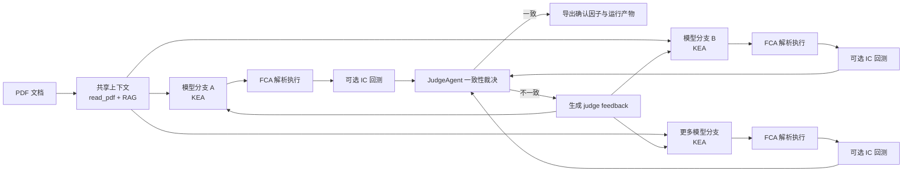

# FactorGenAgent

面向量化因子研究的多智能体流水线：从 PDF 文档中检索候选知识，由 `KnowledgeExtractAgent`生成因子表达式，经 `FactorConstructAgent` 解析执行并回测后，再由 `JudgeAgent` 做一致性裁决，最终导出可直接用于下游选股与组合构建的确认因子。


---

## 核心能力

- 从论文、研报等 PDF 中抽取与因子构造相关的上下文片段
- 基于字段白名单与算子白名单，生成严格受约束的符号因子表达式
- 在面板数据上解析并执行表达式，生成因子值
- 计算横截面 IC（Pearson）作为基础回测结果
- 对多个模型生成的结果做因子数量和数值级一致性校验
- 将不一致信息回灌到下一轮生成，提升跨模型收敛概率
- 将确认通过的因子与运行元数据导出为结构化产物

---

## 架构总览



### 工作流说明

1. `JudgeAgent` 先读取 PDF，并执行一次共享 RAG 检索。
2. 多个候选模型在同一份shared context上分别调用 `KnowledgeExtractAgent` 生成 JSON 因子指令。
3. 每个模型分支将指令交给 `FactorConstructAgent`，解析表达式并在 Parquet 面板数据上执行。
4. 若执行成功，可进一步计算每个因子的 IC 序列。
5. `JudgeAgent` 对所有成功分支做一致性裁决：
   - 先检查是否全部 `no_factor`
   - 再检查是否有分支失败
   - 再检查因子数量是否一致
   - 最后检查对应因子的数值结果是否在容差内一致
6. 若不一致，`JudgeAgent` 会构造 `judge_feedback` 并进入下一轮 refinement。
7. 若一致，系统将确认因子，并导出供下游使用的结构化文件。

---

## 模块说明

### 主入口

| 路径 | 作用 |
|------|------|
| [`run.py`](run.py) | 当前推荐入口。负责解析命令行参数、运行 `JudgeAgent`、导出运行产物到 `factor_runs/`。 |
| [`main.ipynb`](main.ipynb) | Notebook 实验入口。 |

### 智能体

| 路径 | 作用 |
|------|------|
| [`agents/KnowledgeExtractAgent.py`](agents/KnowledgeExtractAgent.py) | `KEA`：加载 `configs/fields.json` 与 `configs/operators.json` 构造 prompt，执行 PDF + RAG + LLM 生成因子 JSON。 |
| [`agents/FactorConstructAgent.py`](agents/FactorConstructAgent.py) | `FCA`：解析表达式、执行因子计算，并提供 `backtest` 计算横截面 IC。 |
| [`agents/JudgeAgent.py`](agents/JudgeAgent.py) | `JA`：共享上下文、驱动多模型分支、比较因子结果、生成 judge feedback、持久化确认结果或错误历史。 |


### 工具与底层执行

| 路径 | 作用 |
|------|------|
| [`utils/tools.py`](utils/tools.py) | `read_pdf`、`rag_search`、`call_llm_api`。 |
| [`utils/interpreter.py`](utils/interpreter.py) | 表达式 AST 解析与节点执行器。 |
| [`utils/error_utils.py`](utils/error_utils.py) | 统一错误日志记录与重试反馈构造。 |

### 配置与数据

| 路径 | 作用 |
|------|------|
| [`configs/fields.json`](configs/fields.json) | 表达式允许引用的字段白名单。 |
| [`configs/operators.json`](configs/operators.json) | 表达式允许使用的算子白名单及签名约束。 |
| [`data/`](data/) | 示例 PDF 和示例数据目录。 |
| [`hub/`](hub/) | 本地嵌入模型目录，当前默认使用 `BAAI/bge-m3`。 |

### 运行产物

| 路径 | 作用 |
|------|------|
| [`judgement_output/`](judgement_output/) | Judge 级别的持久化结果，包括确认因子、回测文件、确认历史与错误历史。 |
| [`factor_runs/`](factor_runs/) | 每次通过 `run.py` 启动后的独立运行目录，便于下游消费与审计。 |
| [`error_events.jsonl`](error_events.jsonl) | 全局错误事件日志。 |

---

## JudgeAgent 的一致性判定逻辑

`JudgeAgent.compare_models(...)` 当前会输出以下几类决策：

| decision | 含义 |
|------|------|
| `all_models_returned_no_factor` | 所有模型都认为无法构造有效因子，视为一致。 |
| `models_failure` | 至少一个模型分支在生成、解析或执行阶段失败。 |
| `no_factor_conflict` | 部分模型返回 `no_factor`，其余模型却构造出了可执行因子。 |
| `factor_count_mismatch` | 各模型返回的最终可交易因子数量不同。 |
| `factor_value_mismatch` | 因子数量一致，但对应因子的数值结果不一致。 |
| `consistent_factor_values` | 因子数量一致，且逐因子数值比较通过，判定为最终一致。 |

### 数值一致性的判断标准

两个模型对同一因子的结果只有在以下条件同时满足时，才会被视为一致：

- `(Trddt, Stkcd)` 索引集合完全一致
- 缺失值分布模式一致
- 没有只存在于单边的数据行
- 重叠样本上的最大绝对误差不超过 `numeric_tolerance`

默认容差为 `1e-5`，可通过 `run.py --numeric-tolerance` 调整。

---

## 输入数据要求

### 1. PDF

- 任意可被 `pdfplumber` 读取的 PDF 文件
- 典型输入包括论文、策略说明、研报等

### 2. 面板数据 Parquet

`FCA` 和 `JudgeAgent` 默认使用 `--parquet-path /data/stock_data.parquet`。这里的 `/data/...` 不是系统根目录，而是会被解析为项目根目录下的相对路径，即：

```text
/data/stock_data.parquet
=> <project_root>/data/stock_data.parquet
```

当前实现至少依赖以下列：

- `Trddt`：交易日期
- `Stkcd`：股票代码
- `ChangeRatio`：下一期收益回测所需字段

此外，因子表达式中引用的字段必须：

- 出现在 [`configs/fields.json`](configs/fields.json) 中
- 同时真实存在于 Parquet 文件列中

### 3. 回测定义

`FCA.backtest(...)` 当前实现的是逐日横截面 IC：

- 将因子值按 `Trddt x Stkcd` 透视为宽表
- 将 `ChangeRatio` 透视后执行 `shift(-1)`
- 用 `t` 日因子值与 `t+1` 日收益做 Pearson 相关
- 输出索引为 `Trddt` 的 IC 序列

---

## 环境与依赖

安装依赖：

```bash
pip install -r requirements.txt
```

`requirements.txt` 当前包含的核心依赖有：

- `openai`
- `pandas`
- `numpy`
- `pdfplumber`
- `faiss-cpu`
- `langchain-text-splitters`
- `sentence-transformers`
- `torch`
- `pyarrow`
- `polars`

### 模型与设备

- RAG 嵌入模型默认从 [`hub/models--BAAI--bge-m3`](hub/models--BAAI--bge-m3) 加载
- `JudgeAgent` 会优先使用 `mps`，其次 `cuda`，最后回退到 `cpu`
- `KEA` 当前优先使用 `cuda`，否则使用 `cpu`

### 支持的 LLM 名称

`utils/tools.py` 当前对白名单模型做了限制，仅支持：

- `DeepSeek-V3.2`
- `Qwen3.5-27B`
- `GLM-5`
- `MiniMax-2.5`


## 快速开始

### 推荐用法：运行 JudgeAgent 主流程

在项目根目录执行：

```bash
python run.py \
  --pdf-path data/sample1.pdf \
  --query "construct a factor" \
  --models DeepSeek-V3.2 Qwen3.5-27B \
  --parquet-path /data/stock_data.parquet
```

如果你想比较更多模型，可以继续追加：

```bash
python run.py \
  --pdf-path data/sample1.pdf \
  --query "construct a factor" \
  --models DeepSeek-V3.2 Qwen3.5-27B GLM-5 MiniMax-2.5
```


## `run.py` 参数说明

| 参数 | 类型 | 默认值 | 说明 |
|------|------|--------|------|
| `--pdf-path` | `str` | `data/sample1.pdf` | 输入 PDF 路径。 |
| `--query` | `str` | `construct a factor` | RAG 检索与任务描述使用的查询文本。 |
| `--models` | `list[str]` | `DeepSeek-V3.2 Qwen3.5-27B` | 参与裁决的模型列表，至少需要 2 个。 |
| `--parquet-path` | `str` | `/data/stock_data.parquet` | 传给 `JudgeAgent` 的面板数据路径。 |
| `--numeric-tolerance` | `float` | `1e-5` | 因子数值比较时的容差。 |
| `--max-retries` | `int` | `5` | 单次 LLM 输出 JSON 解析失败后的最大重试次数。 |
| `--max-rounds` | `int` | `2` | 单模型分支内部的 KEA/FCA refinement 最大轮数。 |
| `--max-judge-iterations` | `int` | `3` | 多模型之间不一致时的 judge-level refinement 最大轮数。 |
| `--export-root` | `str` | `factor_runs/` | 每次运行结果的导出根目录。 |

---

## 输出目录说明

### 1. `judgement_output/`

由 `JudgeAgent` 直接维护，主要用于长期持久化：

```text
judgement_output/
├── confirmed_factors/
│   └── <timestamp>__factor_<idx>__<factor_name>.pkl
├── backtests/
│   └── <timestamp>__factor_<idx>__<factor_name>.csv
├── confirmed_history.jsonl
└── mistakes_history.jsonl
```

- `confirmed_history.jsonl`：记录所有判定一致的最终结果
- `mistakes_history.jsonl`：记录不一致或失败的 judge 决策结果
- `confirmed_factors/*.pkl`：确认因子的原始长表结果
- `backtests/*.csv`：对应因子的 IC 回测结果

### 2. `factor_runs/<timestamp>__<pdf_stem>/`

由 `run.py` 在每次运行时导出，适合下游直接消费：

```text
factor_runs/<run_id>/
├── decision.json
├── manifest.json
├── confirmed_factors.parquet
├── iteration_history.json
├── issue_report.json              # 仅不一致时存在
└── factors/
    └── 00__<factor_name>/
        ├── factor_values_long.parquet
        ├── factor_values_wide.parquet
        ├── backtest.parquet       # 若存在回测
        └── metadata.json
```

关键文件说明：

- `decision.json`：完整 Judge 决策结果
- `manifest.json`：面向下游消费的摘要索引
- `confirmed_factors.parquet`：确认因子总表
- `iteration_history.json`：每轮 judge iteration 的快照
- `issue_report.json`：不一致原因说明
- `metadata.json`：单因子元数据与存储路径

---

## 返回结果结构

`JudgeAgent.run_ja(...)` 返回一个字典，核心字段包括：

| 字段 | 含义 |
|------|------|
| `consistent` | 最终是否达成一致 |
| `decision` | 本次 judge 的决策类型 |
| `models` | 参与比较的模型列表 |
| `model_reports` | 每个模型的状态、错误信息和输出因子摘要 |
| `final_factors` | 最终确认通过的因子列表 |
| `issue_report` | 不一致时的原因与细节 |
| `judge_iteration` | 最终停留的 judge 轮次 |
| `iteration_history` | 每轮 judge 决策快照 |
| `latest_feedback` | 若未收敛，最后一次生成给下一轮的反馈文本 |

当 `consistent == true` 时，`final_factors` 中的每个元素通常包含：

- `factor_index`
- `factor_name`
- `expression`
- `core_logic`
- `data_source`
- `source_models`
- `expression_consensus`
- `name_consensus`
- `factor_value_path`
- `backtest_path`

---

## 错误处理与重试

- `utils/error_utils.record_error_event(...)` 会将错误统一追加写入 [`error_events.jsonl`](error_events.jsonl)
- `FCA` 在表达式解析或执行失败时，会构造 `feedback` 返回给上游
- `JudgeAgent` 在模型之间不一致时，会额外构造 `judge_feedback`，要求下一轮输出更收敛的结果
- 单模型分支内的 refinement 由 `--max-rounds` 控制
- 多模型之间的 refinement 由 `--max-judge-iterations` 控制

---

